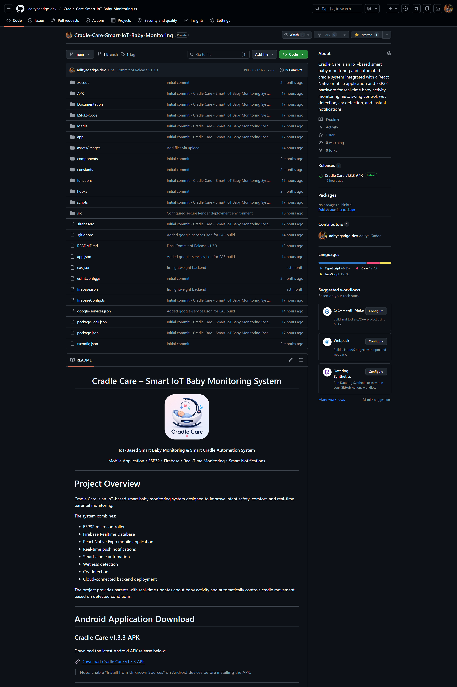

<h1 align="center">
Cradle Care – Smart IoT Baby Monitoring System
</h1>

<p align="center">
  
</p>

<p align="center">
  <b>IoT-Based Smart Baby Monitoring & Smart Cradle Automation System</b>
</p>

<p align="center">
  Mobile Application • ESP32 • Firebase • Real-Time Monitoring • Smart Notifications
</p>

---

# Project Overview

Cradle Care is an IoT-based smart baby monitoring system designed to improve infant safety, comfort, and real-time parental monitoring.

The system combines:

* ESP32 microcontroller
* Firebase Realtime Database
* React Native Expo mobile application
* Real-time push notifications
* Smart cradle automation
* Wetness detection
* Cry detection
* Cloud-connected backend deployment

The project provides parents with real-time updates about baby activity and automatically controls cradle movement based on detected conditions.

---

# Android Application Download

## Cradle Care v1.3.3 APK

Latest Android development build release:

🔗 Publicly unavailable at the moment

> Note:
> Contact **adityagadge.dev@gmail.com** for release `v1.3.3.apk`
>
> Enable **"Install from Unknown Sources"** on Android devices before installing the APK.

---

# Code Snippets Notice

The following snippets are simplified showcase examples from the Cradle Care - Smart IoT Baby Monitoring System project.

Sensitive backend architecture, Firebase credentials, deployment configurations, proprietary algorithms, and complete implementation details have been intentionally excluded for security, deployment safety, and intellectual property protection.

This public repository is intended solely for portfolio and educational demonstration purposes.

Unauthorized reproduction, redistribution, commercial usage, or direct submission of this work as an original project is discouraged without prior permission from the author.

For recruiter verification, technical discussion, collaboration opportunities, or cross-verification of the complete private repository and backend infrastructure, requests can be made at:

📧 adityagadge.dev@gmail.com

---

# Private Development Repository Preview

The original production repository, backend deployment infrastructure, and complete development history remain private for security and intellectual property protection.

Below are preview screenshots from the original private development repository used during active project development and deployment.

<p align="center">
  
</p>

---

# Key Features

## Smart Baby Monitoring

* Real-time cry detection
* Wet diaper detection
* Live activity monitoring
* Firebase cloud synchronization

## Smart Cradle Automation

* Automatic cradle swing on cry detection
* Manual swing control from mobile app
* Continuous swing mode
* Smooth servo-based motion control

## Mobile Application

* Modern React Native Expo application
* Real-time activity updates
* Push notification alerts
* Baby activity dashboard
* Cradle control interface

## Cloud Integration

* Firebase Realtime Database
* Render backend deployment
* Expo push notifications
* Real-time synchronization

---

# System Architecture

```text
ESP32 Sensors
     ↓
Firebase Realtime Database
     ↓
Render Backend Server
     ↓
Expo Push Notification Service
     ↓
Cradle Care Mobile Application
```

---

# Technologies Used

## Software Technologies

* React Native Expo
* TypeScript
* JavaScript
* Firebase Realtime Database
* Firebase Admin SDK
* Express.js
* Node.js
* Expo Notifications
* Expo Router
* Render Cloud Deployment

## Hardware Technologies

* ESP32 Microcontroller
* Servo Motor
* Soil Moisture Sensor
* Sound Sensor Module
* Smart Cradle Prototype

## Development Tools

* Android Studio
* Visual Studio Code
* Postman
* Git & GitHub
* Blender 3D
* Firebase Console
* Render Cloud Platform
* ChatGPT

---

# Mobile Application Features

* Baby activity monitoring
* Cry activity logging
* Wet detection logging
* Manual cradle swing control
* Automatic cradle swing mode
* Real-time Firebase synchronization
* Push notification alerts
* Clean modern UI

---

# ESP32 Functionalities

* WiFi connectivity
* Firebase communication
* Cry detection
* Wetness detection
* Automatic servo control
* Manual swing handling
* Real-time database updates

---

# Backend Functionalities

The backend server:

* Monitors Firebase database changes
* Sends Expo push notifications
* Maintains activity logs
* Updates cry and wet counters
* Prevents duplicate triggers
* Handles cloud synchronization

---

# Project Folder Structure

```text
CRADLECARE-PORTFOLIO/
│
├── Code-Snippets/
│   ├── DISCLAIMER.md
│   ├── esp32-sensor-example.ino
│   ├── express-server-example.js
│   ├── firebase-listener-example.js
│   ├── push-notification-example.js
│   └── status-card-example.tsx
│
├── Documentation/
│   ├── Circuit-Diagram/
│   ├── Final-Review-PPT/
│   ├── Report/
│   └── Research-Paper/
│
├── ESP32-Code/
│   ├── esp32-smart-cradle-v1.ino
│   ├── esp32-smart-cradle-v2.ino
│   └── esp32-smart-cradle-v3.ino
│
├── images/
│
├── Media/
│   ├── App-Screenshots/
│   ├── App-Testing-Videos/
│   ├── Blender-Model-Reference/
│   ├── Prototype-Photos/
│   └── Prototype-Working-Videos/
│
├── Showcase-Code/
│   ├── ActivityScreen-UI.tsx
│   ├── BabySetup-UI.tsx
│   ├── DashboardCard.tsx
│   └── HomeScreen-UI.tsx
│
└── README.md
```

---

# Screenshots

Application screenshots are available inside:

```text
Media/App-Screenshots/
```

---

# Prototype Photos

Prototype images are available inside:

```text
Media/Prototype-Photos/
```

---

# Working Videos

Prototype working videos are available inside:

```text
Media/Prototype-Working-Videos/
```

---

# Blender Model References

3D prototype reference models are available inside:

```text
Media/Blender-Model-Reference/
```

---

# Documentation

Project documentation includes:

* Final Review Presentation
* Circuit Diagram
* Project Report
* Research Paper References

Located inside:

```text
Documentation/
```

---

# Showcase UI Components

Simplified portfolio showcase UI components are available inside:

```text
Showcase-Code/
```

Included showcase screens:

* HomeScreen-UI.tsx
* DashboardCard.tsx
* ActivityScreen-UI.tsx
* BabySetup-UI.tsx

---

# Firebase Integration

Firebase Realtime Database is used for:

* Live sensor updates
* Real-time app synchronization
* Activity logging
* Device communication
* Cradle control handling

---

# Backend Deployment

Backend server deployed successfully on Render Cloud Platform.

Live Backend URL:

```text
https://cradlecare-securebackend.onrender.com
```

---

# Installation Guide

## Mobile Application Setup

```bash
npm install
npx expo start
```

## Android Development Build

```bash
npx expo run:android
```

## EAS Build

```bash
npx eas build --platform android
```

---

# ESP32 Setup

1. Open ESP32 code from:

```text
ESP32-Code/
```

2. Install required libraries:

* WiFi.h
* HTTPClient.h
* ESP32Servo.h

3. Configure:

* WiFi credentials
* Firebase URL
* Sensor pins

4. Upload code using Arduino IDE.

---

# Version History

## Version 1.0

* Initial Smart Cradle prototype
* Firebase integration
* Basic monitoring features

## Version 1.2

* Added Baby Activity page
* Improved UI
* Minor bug fixes

## Version 1.3

* Fixed Expo Go notifications
* Improved backend communication

## Version 1.3.3

* Fixed development build notifications
* Added professional app branding
* Improved app icon and splash screen
* Backend deployment optimization

---

# Team Contribution

| Name | Contribution |
|------|--------------|
| Aditya S. Gadge | Lead Mobile App Development, Firebase Integration, Blender 3D Modeling, Documentation |
| Shubham S. Ghagas | Arduino/ESP32 Coding, Virtual Simulation, Hardware Assembly |
| Yug Goyal | Hardware Procurement, Prototype Simulation, Hardware Assembly |
| Saksham Gupta | Raw Material Procurement, Prototype Design & Development, Prototype Finalization |
| Shivrani Iggagunta | Prototype Concept Ideation, Prototype Design & Development, Prototype Finalization |

---

# Future Scope

* AI-based baby sleep analysis
* Live camera streaming
* Health monitoring integration
* Voice assistant support
* Smart analytics dashboard
* Remote parent monitoring
* IoT device scaling

---

# APK Download

APK builds will be available privately upon request.

Latest Stable Version:

```text
Cradle Care v1.3.3
```

---

# Research Paper

Research paper documentation and references are available inside:

```text
Documentation/Research-Paper/
```

---

# Repository Notice & Verification

This public repository is a portfolio-oriented showcase version of the Cradle Care - Smart IoT Baby Monitoring System project.

Sensitive backend infrastructure, Firebase credentials, deployment configurations, proprietary implementation details, and complete production source code have been intentionally excluded for security and intellectual property protection.

Unauthorized reproduction, redistribution, commercial usage, or direct academic submission of this work as an original project is discouraged without prior permission from the author.

For recruiter verification, technical discussions, collaboration opportunities, or cross-verification of the complete private repository and backend implementation, requests may be made at:

📧 adityagadge.dev@gmail.com

---

# Contact Information

## Developer

Aditya Gadge

## LinkedIn

www.linkedin.com/in/aditya-gadge-3a9863392

## Email

adityagadge.dev@gmail.com

---

# License & Copyright

Copyright © 2026 Aditya Gadge.

All rights reserved.

This project, including its source code, documentation, media, designs, architecture, and implementation, is proprietary intellectual property.

Unauthorized copying, reproduction, modification, distribution, commercial usage, or deployment of this project is strictly prohibited without prior written permission from the owner.

Research paper and copyright verification processes are currently in progress.

---

# Acknowledgements

Special thanks to:

* KJ Somaiya College of Engineering
* Faculty mentors and reviewers
* Firebase Platform
* Expo Ecosystem
* Render Cloud Platform
* Open-source developer community

---

<p align="center">
  <b>Cradle Care – Smart IoT Baby Monitoring System</b>
</p>
